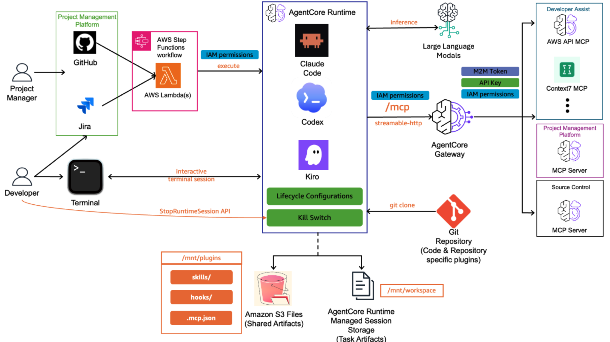

# Agent-Assisted SDLC

**From issue to pull request, autonomously.**

> [!IMPORTANT]
> This sample is in preview and under active development. APIs, infrastructure, and behavior may change without notice.

This sample deploys an agentic software development pipeline on [Amazon Bedrock AgentCore](https://aws.amazon.com/bedrock/agentcore/). Describe what you want built in an issue, add a label, and an AI coding assistant explores the codebase, implements the feature, and opens a pull request.



## Components

This solution is built on Amazon Bedrock AgentCore's modular services. Each component maps to a specific AgentCore capability:

### 1. Coding Assistant

The coding assistant is the core workload, an AI agent (Claude Code, Codex, or Kiro) that reads an issue specification and produces working code. Its behavior is driven by two layers of plugins: a shared orchestration plugin (deployed to S3 Files, available to all sessions) and a repository-specific plugin (committed to the target repo by the developer).

| Platform | Status | Plugin | Details |
|----------|--------|--------|---------|
| Claude Code | ✅ Stable | [plugin/](./coding-assistants/claude-code/plugin/) | [claude-code](./coding-assistants/claude-code/) |
| Kiro | ⚠️ Experimental | [plugin/](./coding-assistants/kiro/plugin/) | [kiro](./coding-assistants/kiro/) |
| Codex | ⚠️ Experimental | [plugin/](./coding-assistants/codex/plugin/) | [codex](./coding-assistants/codex/) |

The shared plugin provides the orchestration pipeline (explore → implement → critique → PR). The repository-specific plugin tells the assistant how to build and test that particular codebase.

<details>
<summary> <b> Explore Features </b> </summary>

| Feature | What it provides | How this project uses it |
|-------------------|-----------------|--------------------------|
| [AgentCore Runtime](https://docs.aws.amazon.com/bedrock-agentcore/latest/devguide/agents-tools-runtime.html) | Serverless microVM compute with per-session isolation | Hosts the coding assistant container (Claude Code). Each issue gets its own isolated session. |
| [Managed Session Storage](https://docs.aws.amazon.com/bedrock-agentcore/latest/devguide/runtime-filesystem-configurations.html) | Persistent filesystem that survives stop/resume cycles | Mounted at `/mnt/workplace`: the cloned repository, installed packages, and build artifacts persist across the session. |
| [S3 Files](https://docs.aws.amazon.com/bedrock-agentcore/latest/devguide/runtime-filesystem-configurations.html) | Shared read/write NFS mount backed by S3 | Mounted at `/mnt/plugins`: shared plugin (skills, hooks, MCP config) available to all sessions. |
| [Lifecycle Configuration](https://docs.aws.amazon.com/bedrock-agentcore/latest/devguide/runtime-lifecycle-settings.html) | Idle timeout + max lifetime controls | Sessions auto-terminate after idle period. Max lifetime ensures token expiry alignment. |
| [StopRuntimeSession API](https://docs.aws.amazon.com/bedrock-agentcore/latest/devguide/runtime-stop-session.html) | Kill switch: terminate any session on demand | Emergency stop for runaway agents. Callable from the developer terminal or ops Lambda. |
| [Shared plugin](./coding-assistants/claude-code/plugin/) | Skills, hooks, MCP config, settings that apply to all repositories | `coding-assistants/claude-code/plugin/` (deployed to S3 Files, shared across all sessions) |
| Repository-specific plugin | CLAUDE.md with stack info, test commands, conventions specific to one repo | Placed in the target repo's `.claude/` directory by the developer |

</details>


### 2. AgentCore Gateway

The gateway is the central entrypoint for all tool calls. The coding assistant connects to a single gateway and gets access to all registered tools: source control, project management, and developer tools.

<details>
<summary> <b> Explore Features </b> </summary>

| Feature | What it provides | How this project uses it |
|-------------------|-----------------|--------------------------|
| [AgentCore Gateway](https://docs.aws.amazon.com/bedrock-agentcore/latest/devguide/gateway-core-concepts.html) | Unified MCP endpoint with IAM/JWT auth, tool routing, and automatic tool discovery | Single gateway URL in the plugin's `.mcp.json`. Routes tool calls to the correct MCP server target. |
| [Gateway Targets](https://docs.aws.amazon.com/bedrock-agentcore/latest/devguide/gateway-building-adding-targets-authorization.html) | Register MCP servers with credential configuration | Each MCP server (GitHub code, GitHub issues, AWS docs) is a target with IAM-based credential brokering. |
| [Gateway IAM Proxy](./gateway/gateway-iam-proxy/) | stdio-to-StreamableHTTP bridge with SigV4 signing | Runs inside the coding assistant container. Claude Code speaks stdio; the proxy signs requests with the container's IAM role and forwards to the gateway. Handles `mcp-session-id` and protocol version negotiation. |
| AWS Docs MCP Server | Search, read, and get recommendations across all AWS documentation | [gateway/developer-mcp-servers/aws-docs/](./gateway/developer-mcp-servers/aws-docs/) |
| CFN Docs MCP Server | Search CloudFormation/CDK docs and validate templates with cfn-lint | [gateway/developer-mcp-servers/cfn-docs/](./gateway/developer-mcp-servers/cfn-docs/) |

</details>

### 3. Project Management Platform

The project management platform is what developers interact with day-to-day. It serves two purposes in this solution: (1) triggering the agentic pipeline when work is assigned, and (2) providing MCP tools so the coding assistant can read issue details, post progress comments, and update status labels throughout execution.

| Platform | Status | Details |
|----------|--------|---------|
| GitHub Issues | ✅ | [project-management/github/](./project-management/github/) |

Each project management platform has two parts:

- **Connector** (event-driven trigger)
  - Watches for a trigger event (e.g., `agent:start` label added to an issue)
  - Resolves the full issue context (title, body, comments) via GraphQL
  - Authenticates to AWS via OIDC (zero long-lived secrets in GitHub)
  - Starts the Step Functions state machine with the issue payload
  - Posts a confirmation comment on the issue
  - Location: [project-management/github/connector/](./project-management/github/connector/)

- **MCP Server** (tools for the coding assistant)
  - Deployed as an AgentCore Runtime, registered as a gateway target
  - Provides tools: `issue_read`, `issue_write`, `add_issue_comment`, `list_issues`, `search_issues`
  - The coding assistant uses these to read the issue spec, post progress updates, and set labels (`stage:implementing`, `state:pr-created`)
  - Location: [project-management/github/mcp/](./project-management/github/mcp/)


### 4. Source Control

The source control platform is where code lives. The coding assistant needs to create branches, push files, open pull requests, and read existing code. Rather than giving the agent direct git credentials, all code operations go through an MCP server that handles authentication via credential brokering.

| Platform | Status | Details |
|----------|--------|---------|
| GitHub | ✅ | [source-control/github/](./source-control/github/) |

Each source control platform provides:

- **MCP Server** (code operations for the coding assistant)
  - Deployed as an AgentCore Runtime, registered as a gateway target
  - Provides tools: `create_branch`, `push_files`, `create_pull_request`, `get_file_contents`, `list_commits`, `list_branches`, `search_code`
  - The coding assistant uses these to implement features and open PRs without ever holding git credentials
  - Location: [source-control/github/mcp/](./source-control/github/mcp/)

- **Token Generation** (credential brokering)
  - The MCP server container generates a short-lived GitHub App installation token at startup
  - Token is created from the private key stored in Secrets Manager (JWT signed → exchanged for 1-hour installation token)
  - The gateway and coding assistant never see the token; only the MCP server uses it to authenticate with the GitHub API
  - Container max lifetime (55 min) ensures recycling before token expiry

## Quick Start

> [!WARNING]
> This is sample code for demonstration and educational purposes. It has not undergone a production security review. Do not deploy to production environments without conducting your own security assessment, penetration testing, and compliance review appropriate for your organization.

### Prerequisites

Before you begin, ensure you have:

- [Node.js](https://nodejs.org/) v20+
- [AWS CDK CLI](https://docs.aws.amazon.com/cdk/v2/guide/cli.html) (`npm install -g aws-cdk`)
- AWS credentials configured with permissions to deploy CloudFormation stacks
- A GitHub App created and installed on your target repositories (see [GitHub App Setup](./project-management/github/connector/README.md))
- GitHub OIDC provider configured in your AWS account (see [Create an OIDC identity provider in IAM](https://docs.aws.amazon.com/IAM/latest/UserGuide/id_roles_providers_create_oidc.html)). If not already created, run:
  ```bash
  aws iam create-open-id-connect-provider \
    --url https://token.actions.githubusercontent.com \
    --client-id-list sts.amazonaws.com \
    --thumbprint-list "ffffffffffffffffffffffffffffffffffffffff"
  ```
  The thumbprint is a placeholder; AWS verifies GitHub's certificate via its trusted CA library.

### Step 1: Clone and install

```bash
git clone https://github.com/aws-samples/sample-agent-assisted-sdlc.git && cd sample-agent-assisted-sdlc
npm install
cp sdlc-config.template.yaml sdlc-config.yaml
```

### Step 2: Create a GitHub App

If you haven't already, create a GitHub App with these repository permissions:

| Permission | Access |
|-----------|--------|
| Contents | Read & Write |
| Pull requests | Read & Write |
| Issues | Read & Write |
| Metadata | Read-only |

Install the app on the repositories you want the agent to work on. Note the **Client ID**, **Installation ID**, and download the **Private Key** (`.pem` file).

### Step 3: Configure

Edit `sdlc-config.yaml` (copied from template in Step 1) with your values:

```yaml
project: my-sdlc-agent
region: us-west-2

codingAssistant:
  type: claude-code

sourceControl:
  type: github
  github:
    org: "myorg"                       # GitHub organization or username
    appClientId: "Iv23li..."           # From GitHub App settings
    installationId: "12345678"         # From installation URL
    privateKeyPath: "./my-app.pem"     # Path to downloaded .pem file
    privateRepo: false                 # Set true for private repositories
    allowedRepos:                      # Repos that can trigger the pipeline
      - "myorg/my-repo"

projectManagement:
  type: github
  github:
    toolsets: issues
    allowedUsers:                     # GitHub usernames that can trigger the pipeline
      - "myuser"

gateway:
  authorizerType: AWS_IAM
  developerMcpServers:                 # Optional
    - name: aws-docs
      source: ./gateway/developer-mcp-servers/aws-docs
    - name: cfn-docs
      source: ./gateway/developer-mcp-servers/cfn-docs
```

See [sdlc-config.template.yaml](./sdlc-config.template.yaml) for the full config reference with inline documentation.

### Step 4: Deploy

The solution deploys as 6 stacks in dependency order:

```bash
# Bootstrap CDK (first time only)
npx cdk bootstrap

# Deploy all stacks (respects dependency order)
npx cdk deploy --all
```

| Stack | What it deploys |
|-------|----------------|
| `<project>-infra` | VPC, security groups |
| `<project>-source-control` | GitHub code MCP server runtime |
| `<project>-project-management` | GitHub issues MCP server runtime |
| `<project>-developer-mcp` | Developer MCP servers (aws-docs, cfn-docs) |
| `<project>-gateway` | AgentCore Gateway + registers all MCP targets |
| `<project>-assistant` | Coding assistant runtime, S3 Files, Step Functions, Lambdas, OIDC role |

Deploy individually:
```bash
npx cdk deploy my-sdlc-agent-infra
npx cdk deploy my-sdlc-agent-source-control
npx cdk deploy my-sdlc-agent-gateway
npx cdk deploy my-sdlc-agent-assistant
```

### Step 5: Connect your target repository

After deploy, note the CDK outputs:

| Output | What to do |
|--------|------------|
| `StateMachineArn` | Add as repository secret `SDLC_PIPELINE_STATE_MACHINE_ARN` |
| `GitHubActionsRoleArn` | Add as repository secret `SDLC_PIPELINE_ROLE_ARN` |

Then add the GitHub Actions workflow to your target repo:

```bash
# Copy the workflow template
cp project-management/github/connector/workflow/agent-start.yml \
   /path/to/your-repo/.github/workflows/agent-start.yml
```

### Step 6: Trigger the pipeline

1. Open an issue in your target repository with a clear specification
2. Add the label `agent:start`
3. The agent starts working. You'll see a comment confirming the pipeline began.
4. When complete, a pull request appears with the implementation.

### Optional: Add a repository-specific plugin

For best results, add a `.claude/CLAUDE.md` to your target repo describing the stack, test commands, and conventions:

```markdown
# Project Context

## Stack
- Python 3 / FastAPI
- PostgreSQL
- pytest for tests

## Test command
pytest -q

## Conventions
- Branch naming: feat/issue-{number}
- Always run tests before committing
```

This tells the coding assistant how to build and test your specific codebase.

## Security

See **[SECURITY-PRACTICES.md](./SECURITY-PRACTICES.md)** for the full security model: credential isolation, session isolation, token lifetime alignment, tool-call interception hooks, permission scoping, and prompt injection defense.

See [CONTRIBUTING](CONTRIBUTING.md#security-issue-notifications) for more information.

## License

This project is licensed under the Apache-2.0 License.

